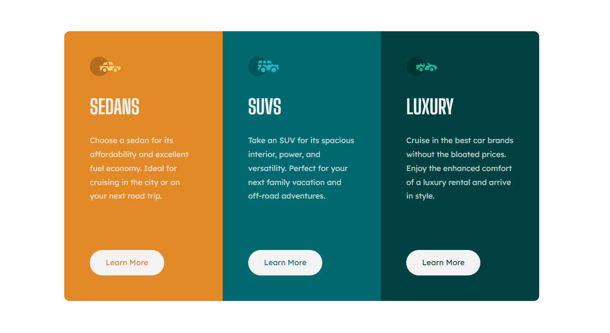

# Frontend Mentor - 3-column preview card component solution

This is a solution to the [3-column preview card component challenge on Frontend Mentor](https://www.frontendmentor.io/challenges/3column-preview-card-component-pH92eAR2-). Frontend Mentor challenges help you improve your coding skills by building realistic projects. 

## Table of contents

- [Overview](#overview)
  - [The challenge](#the-challenge)
  - [Screenshot](#screenshot)
  - [Links](#links)
- [My process](#my-process)
  - [Built with](#built-with)
  - [What I learned](#what-i-learned)
  - [Continued development](#continued-development)
- [Author](#author)

## Overview

### The challenge

Users should be able to:

- View the optimal layout depending on their device's screen size
- See hover states for interactive elements

### Screenshot



### Links

- Solution URL: [GitHub](https://github.com/min4899/Frontend-Mentor-3-Column-Preview-Card-Component)
- Live Site URL: [GitHub Pages](https://min4899.github.io/Frontend-Mentor-3-Column-Preview-Card-Component/)

## My process

### Built with

- Semantic HTML5 markup
- CSS custom properties
- Flexbox

### What I learned

Using combination of margin and max-width, card elements can easily achieve nice looking, responsive layouts for most screen width without cutting into the screen edge. Card will use max-width whenever possible, and resize whenever screen width is smaller. Margins won't be visible when max width is achieved. Margins will provide enough space between card and screen edge once screen width is small enough and resize is applied.

```css
.card {
  z-index: 1;
  display: flex;
  flex-direction: row;
  overflow: hidden;
  border-radius: 0.7rem;
  min-height: 35rem;
  margin: 6rem 1.5rem;
}

.card-section {
  display: flex;
  flex-direction: column;
  max-width: 20.5rem;
  padding: 3.3rem;
}
```

### Continued development

Learn how to use CSS Grid.

## Author

- GitHub - [Minwoo Soh](https://github.com/min4899)
- Frontend Mentor - [@min4899](https://www.frontendmentor.io/profile/min4899)